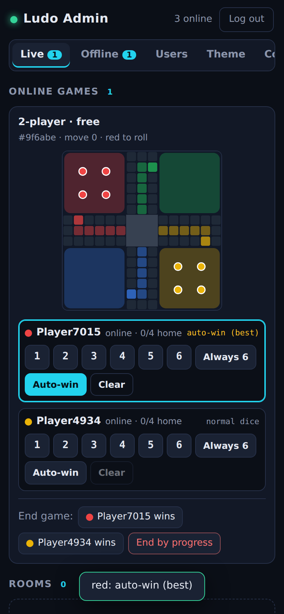

# Ludo Admin — owner control app

Ludo Admin ek **alag app** hai (game app ke andar kuch bhi nahi hai — koi hidden button, PIN ya panel nahi).
Isse server ka owner live games dekh sakta hai, dice control kar sakta hai, coins/users/theme/config manage kar sakta hai.

> Coins sirf free virtual coins hain, inki koi money value nahi hai. Na kharidna, na cash-out — aur aisa hi rahega.



## 1. Owner key (OWNER_KEY)

Admin app me login sirf `OWNER_KEY` se hota hai.

- Server par env var `OWNER_KEY` set karo (Render par `render.yaml` isko auto-generate karta hai — Render dashboard → Environment me dekh lo).
- Agar set nahi hai to server khud ek key banata hai, `DATA_DIR/owner-key` file me save karta hai, aur har startup par log me print karta hai:
  ```
  OWNER_KEY not set; owner key is Xy12... (saved in ./data/owner-key). Open /admin/ to use it.
  ```
- Key badalni ho: `OWNER_KEY` naya set karo (ya `owner-key` file delete karke restart). Purane admin logins turant band.
- Key kisi ko mat do — jiske paas key hai, wo pura server control kar sakta hai.
- Galat key par server `unauthorized` deta hai; ek IP se 1 minute me 10 galat try ke baad baaki minute block.

## 2. Admin app kaise kholein

**Browser se (sabse aasaan):** `https://<your-server>/admin/` kholo → Server URL already bhara hoga → Owner key daalo → *Log in*.
"Remember on this device" tick karoge to agli baar auto-login.

**Android APK:** GitHub Actions ka workflow *Build Android app* ab `ludo-admin-debug-apk` artifact bhi banata hai
(appId `com.mintly.ludo.admin`, naam "Ludo Admin"). Download karke phone par install karo, Server URL me apna server
(e.g. `https://ludo-mintly.onrender.com` ya Wi-Fi par `http://192.168.1.5:3000`) aur owner key daalo.
Ye APK Play Store par **mat** daalna.

Local build: `npm run build -w admin && cd admin && npx cap sync android && cd android && ./gradlew assembleDebug`.

## 3. Tabs

| Tab | Kya kar sakte ho |
|---|---|
| **Overview** | Online players, live games, rooms, total/aaj ke users, aaj ke matches, players ke coins, top 5 aur naye 5 players. |
| **Remote** | Sirf dice remote control: **Tester** accounts ke offline games (aur online games agar `ONLINE_GAME_CONTROL=1` ho). Upar **Remote only** button dabao to baaki tabs chhup jaate hain (is device par yaad rehta hai). |
| **Live** | Saare online games (quick match + private room) live board ke saath, aur waiting private rooms. Dice control / *X wins* sirf tab jab server par `ONLINE_GAME_CONTROL=1` ho (default **band** — neeche dekho). |
| **Offline** | Phones par chal rahe offline games (vs Computer, Pass & Play, Snakes & Ladders) — sirf jab wo phone server se connected ho. Yahan se bhi dice control. |
| **Users** | Naam / Player ID se search, coins **Give/Take**, **rename**, **Ban/Unban** (ban = turant disconnect, game forfeit, dobara login nahi), **Make tester** (apne phone ko test account banao — sirf inhi par offline remote control chalta hai). |
| **Theme** | Sab players ke liye board theme (Classic/Night/Wood/Candy) aur dice skin (White/Gold/Red/Neon). "Player's choice" = player khud chune. **Lock** = player apna theme change nahi kar sakta. Turant sab connected apps par apply. |
| **Config** | Daily rewards, online stakes (entry fees), turn seconds (5-120). Database me save hota hai (restart ke baad bhi). Naye games / app launch par lagta hai. |
| **Notice** | Sab online players ko ek message (toast) bhejo. |

## 4. Online matches: control default band (zaroori)

Online match me asli players ke coins lage hote hain aur wo maante hain ki dice random hai. Unke match ka dice ya
winner chupke se badalna unhe dhokha dena hai, aur Google Play policy ke hisaab se app/account ban ho sakta hai.
Isliye server par `ONLINE_GAME_CONTROL` **default band** hai: Live tab me online games sirf dekh sakte ho. Privacy
policy bhi players ko yahi batati hai ("online matches ka dice koi nahi badalta").

- **Production (Play Store wala server): hamesha `ONLINE_GAME_CONTROL=0` rakho.**
- Sirf apne private testing server par `ONLINE_GAME_CONTROL=1` karke online dice control test kar sakte ho.
- Offline games ka dice control **sirf Tester accounts** par chalta hai (Users → Make tester). Apne phone ka Player ID
  Profile screen me dikhta hai; use Users me search karke Tester banao. Aam players ka offline game server par
  jaata hi nahi, aur unka dice hamesha random hai (privacy policy yahi promise karti hai).

## 5. Dice control (har seat ke liye)

- **1 … 6** — us colour ka *agla* roll yahi aayega (sirf ek baar, phir normal dice).
- **Always 6** — har roll 6 (jab tak Clear na karo). Teesra 6 lagatar hota to turn chali jaati, isliye us waqt best 1-5 value di jaati hai.
- **Auto-win** — har roll par engine har value 1..6 try karta hai aur bot scoring (`scoreMove`: capture > ghar pahunchna > token kholna > safe square) ke hisaab se best value deta hai. Snakes me: jeet sakte ho to jeetne wali value, warna sabse aage wala square (ladder pakdo, snake bachao).
- **Clear** — normal random dice.
- Opponent ko 1 dilana ho: opponent seat par **1** dabao (har turn ke liye dobara dabana padega).

Online games me server authoritative hai: override server par rehta hai aur us colour ke agle roll par lagta hai —
chahe player khud roll kare, timeout par auto-play ho, ya bot ho. **Players ko kuch alag nahi dikhta** — koi event,
koi field, kuch bhi players ko nahi jaata; unko bas normal dice result dikhta hai.

## 6. Offline games ka control — limitation

Offline game phone par hi chalta hai. Game app jab server se connected hota hai to background me chupchaap chhota
sa summary (`offline:state`) bhejta rehta hai, aur admin ka dice command (`offline:dice`) sirf usi phone ko jaata hai,
jo agle roll par apply hota hai.

**Agar phone internet/server se connected nahi hai to offline control kaam nahi karega** — game normal dice se
chalega aur Admin ke Offline tab me wo game nahi dikhega (disconnect hote hi list se hat jaata hai, reconnect par wapas aata hai).

## 7. Security notes

- `/admin` namespace alag hai; normal player tokens se usme connect nahi ho sakta.
- Admin ke saare actions server log me aate hain (`owner coins`, `owner ban`, `game ... ended by owner`, ...).
- Coins ka har change ledger (`coin_tx`) me `owner-gift` / `owner-take` reason ke saath save hota hai.
